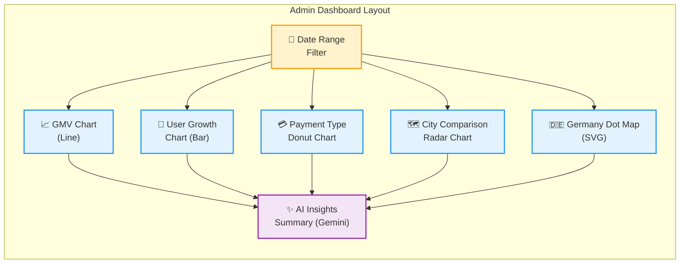
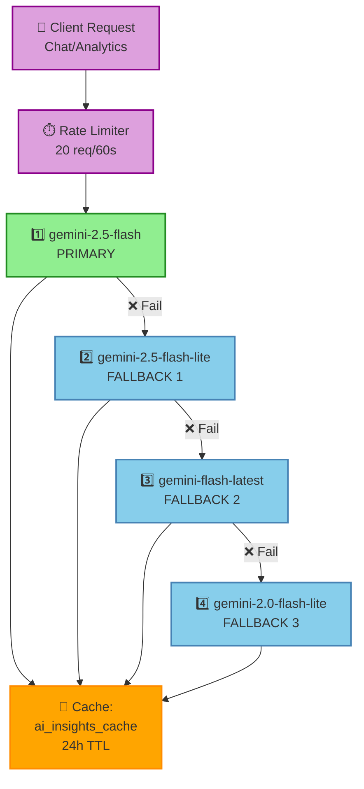
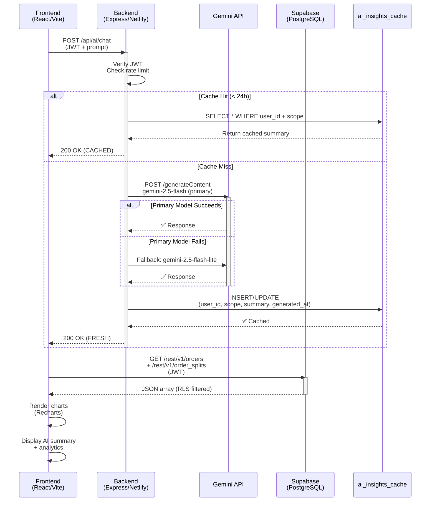

# ProCuro System Design Document (SDD)

## Section 4: System Architecture

### 4.1 System Architecture Overview

**Project Name:** ProCuro  
**System Type:** Multi-tier Halal food procurement marketplace  
**Architecture Pattern:** MERN-like with Serverless Functions  
**Technology Stack:** React 18.3.1, Express.js 4.19.0, PostgreSQL (Supabase), Netlify Functions  
**Deployment Environment:** Netlify (Frontend + Serverless), Express server (local/cloud), Supabase (Database)  

---

## 4.1.1 Architectural Overview

ProCuro implements a **three-tier architecture** with clear separation of concerns:

```
┌─────────────────────────────────────────────────────────────────┐
│                        PRESENTATION TIER                         │
│           React SPA (Vite, 70+ Components, 40+ Routes)          │
│  - Role-based layouts (Owner, Supplier, Admin)                  │
│  - Real-time notifications & charts (Recharts)                  │
│  - Offline-capable PWA (Vite PWA plugin)                        │
└─────────────────────────────────────────────────────────────────┘
                              ↓ (HTTPS/REST)
┌─────────────────────────────────────────────────────────────────┐
│                      APPLICATION TIER                            │
│  ┌──────────────────┐              ┌──────────────────────────┐ │
│  │  Express.js      │  ◄─────────► │  Netlify Functions       │ │
│  │  (localhost:3001)│              │  (/.netlify/functions)   │ │
│  │  - AI routes     │              │  - AI chat (Node.js)     │ │
│  │  - Health checks │              │  - Analytics summary     │ │
│  │  - Auth          │              │  - Serverless compute    │ │
│  │  - Rate limiting │              │  - Google Gemini models  │ │
│  └──────────────────┘              └──────────────────────────┘ │
│           ↓                                  ↓                    │
│        JWT Verification               Service-role auth          │
│        (Supabase tokens)              (Server-to-DB only)       │
└─────────────────────────────────────────────────────────────────┘
                              ↓ (PostgREST/JWT)
┌─────────────────────────────────────────────────────────────────┐
│                        DATA TIER                                  │
│  Supabase PostgreSQL (Germany EU region)                         │
│  ┌────────────────────────────────────┐                          │
│  │ 21 Tables + RLS Policies           │                          │
│  │ - Auth tables (users, profiles)    │                          │
│  │ - Product catalog (products, certs)│                          │
│  │ - Orders (orders, splits, items)   │                          │
│  │ - Communications (conversations)   │                          │
│  │ - Feedback (ratings, reports)      │                          │
│  │ - Analytics (cache, deleted)       │                          │
│  └────────────────────────────────────┘                          │
│  ┌────────────────────────────────────┐                          │
│  │ Storage Buckets (S3-compatible)    │                          │
│  │ - avatars/ (profile photos)        │                          │
│  │ - halal-certificates/ (PDFs)       │                          │
│  │ - product-images/ (catalog)        │                          │
│  │ - invoices/ (generated PDFs)       │                          │
│  └────────────────────────────────────┘                          │
└─────────────────────────────────────────────────────────────────┘
```

---

## 4.2 Deployment Architecture

### 4.2.1 Development Environment

```
Local Machine (macOS)
├── Frontend (Vite dev server, port 5173)
│   ├── React components (src/components)
│   ├── Pages (src/pages)
│   ├── Contexts (src/context)
│   └── Environment: VITE_SUPABASE_URL, VITE_SUPABASE_ANON_KEY
├── Backend (Express server, port 3001)
│   ├── Routes (server/routes)
│   ├── Middleware (server/middleware)
│   └── Environment: PORT, SUPABASE_URL, SUPABASE_SERVICE_ROLE_KEY, GEMINI_API_KEY
└── Concurrent execution (npm run dev)
```

### 4.2.2 Production Deployment

```
Netlify (Frontend + Serverless Functions)
│
├── Build Phase
│   ├── npm run install:all (install root + client + server deps)
│   ├── npm run build (client/dist output)
│   └── Netlify Functions transpilation (Node.js 20)
│
├── Static Assets (client/dist)
│   ├── HTML/CSS/JS (cached: max-age=31536000 for /assets/*)
│   ├── index.html (no-cache for SPA routing)
│   ├── Service worker (for PWA offline support)
│   └── Manifest (PWA installability)
│
├── Netlify Functions
│   ├── /.netlify/functions/ai-chat
│   │   └── Google Gemini integration + rate limiting
│   ├── /.netlify/functions/ai-analytics-summary
│   │   └── Dashboard analytics generation
│   └── Environment: GEMINI_API_KEY, SUPABASE_SERVICE_ROLE_KEY
│
├── Redirects & Rewrites
│   ├── /api/ai/* → /.netlify/functions/* (Force 200)
│   ├── /* → /index.html (SPA catch-all, status 200)
│   └── Security headers (X-Frame-Options, X-Content-Type-Options, etc.)
│
└── Domain Configuration
    ├── HTTPS enforcement
    ├── CSP headers (if configured)
    └── Analytics tracking
```

### 4.2.3 Database Deployment

```
Supabase Cloud (PostgreSQL-based)
│
├── Project: <SUPABASE_PROJECT_REF>
├── Region: Germany (EU compliance)
├── Database
│   ├── 21 tables with CASCADE/RESTRICT FKs
│   ├── 40+ RLS policies
│   ├── 10+ performance indexes
│   └── 19 migrations (001_create_tables → 019_certificate_status)
├── PostgREST API
│   └── Auto-generated REST endpoints from schema
├── Realtime subscriptions
│   └── WebSocket for live notifications (conversations, messages)
├── Storage
│   ├── avatars/ bucket
│   ├── halal-certificates/ bucket
│   ├── product-images/ bucket
│   └── invoices/ bucket
└── Auth (Supabase Auth)
    ├── Email/password authentication
    ├── JWT token generation
    ├── Session management
    └── OAuth integration (optional)
```

### 4.2.4 External Dependencies

```
Google Cloud
├── Gemini API (gemini-2.5-flash primary model)
│   ├── Rate limiting: 20 requests/60s per user
│   ├── Model fallback chain: 
│   │   ├── gemini-2.5-flash (primary)
│   │   ├── gemini-2.5-flash-lite
│   │   ├── gemini-flash-latest
│   │   └── gemini-2.0-flash-lite
│   └── 24-hour cache to protect quota
└── Environment: GEMINI_API_KEY
```

### 4.2.5 Deployment Pipeline

```
Git Push (GitHub)
      ↓
Netlify Auto-Deployment
      ├── 1. Fetch code
      ├── 2. npm run install:all
      ├── 3. npm run build
      │   ├── Client: Vite build → client/dist
      │   ├── Server: Copy to functions/
      │   └── Functions: Auto-wrap with Netlify handler
      ├── 4. Deploy assets to CDN (Netlify Edge)
      ├── 5. Deploy functions to serverless platform
      └── 6. Update DNS/routing
      ↓
Live at https://procuro.netlify.app
```

---

## 4.3 Database Architecture

### 4.3.1 Database Design Principles

**Type:** PostgreSQL via Supabase  
**Normalization:** 3NF (Third Normal Form)  
**Security Model:** Row-Level Security (RLS) on all 21 tables  
**Concurrency Control:** Optimistic locking via timestamps (created_at, updated_at)  

### 4.3.2 Schema Organization

```
PUBLIC SCHEMA (21 tables across 5 domains)

Domain 1: Authentication & User Management (4 tables)
├── users (central registry, mirrors auth.users)
├── addresses (multi-address book)
├── owner_profiles (1:1 restaurant owner data)
└── supplier_profiles (1:1 supplier verification status)

Domain 2: Product Catalog (2 tables)
├── products (inventory with stock tracking)
└── halal_certificates (admin-reviewed certifications)

Domain 3: Order Fulfillment (3 tables)
├── orders (multi-supplier cart container)
├── order_splits (per-supplier fulfillment)
└── order_items (line items with frozen prices)

Domain 4: Payments (2 tables)
├── supplier_bank_details (IBAN for payouts)
└── owner_bank_details (future credit system)

Domain 5: Communications (4 tables)
├── conversations (1-on-1 supplier-owner chats)
├── messages (conversation messages, hard-deleted)
├── admin_conversations (admin direct messaging)
└── admin_messages (admin message thread)

Domain 6: Feedback & Moderation (3 tables)
├── supplier_ratings (post-delivery 1-5 stars)
├── reports (spam/violation flagging)
└── notifications (in-app alert queue)

Domain 7: Analytics & Audit (2 tables)
├── ai_insights_cache (Gemini quota protection, 24h TTL)
└── deleted_accounts (GDPR audit trail)
```

### 4.3.3 Key Relationships

```
MANY-TO-ONE Relationships (Foreign Keys)
├── users ← addresses (1:N) - multi-delivery locations per user
├── users ← orders (1:N) - many orders per restaurant owner
├── supplier_profiles ← products (1:N) - product catalog
├── supplier_profiles ← order_splits (1:N) - fulfillment tracking
├── orders ← order_splits (1:N) - multi-supplier per order
├── order_splits ← order_items (1:N) - line items
└── conversations ← messages (1:N) - conversation threads

ONE-TO-ONE Relationships (UNIQUE Foreign Keys)
├── users ← owner_profiles (1:1) - profile separation
├── users ← supplier_profiles (1:1) - profile separation
├── supplier_profiles ← supplier_bank_details (1:1) - payout routing
└── users ← ai_insights_cache (1:1) - per-user cache
```

### 4.3.4 Critical Delete Rules

```
CASCADE Delete (Safe to Clean Up)
├── users → addresses (remove locations)
├── users → notifications (remove alerts)
├── supplier_profiles → products (remove catalog)
├── orders → order_splits (remove fulfillment)
├── order_splits → order_items (remove line items)
├── conversations → messages (remove thread)
└── users → ai_insights_cache (remove analytics)

RESTRICT Delete (Preserve Audit Trail)
├── users → orders ✓ RESTRICT
│   Rationale: Prevent accidental erasure of order history
├── supplier_profiles → order_splits ✓ RESTRICT
│   Rationale: Preserve supplier-order relationships
└── products → order_items ✓ RESTRICT
   Rationale: Maintain price_at_time historical accuracy
```

### 4.3.5 Storage Buckets

```
Supabase Storage (S3-compatible, public/private URLs)

avatars/ 
├── Public read
├── User owns path: {auth.uid()}/avatar
└── Used by: profile display, supplier logos

halal-certificates/
├── Public read (approved only via RLS)
├── Supplier owns path: {supplier_id}/{cert_id}
└── Used by: supplier verification, customer trust

product-images/
├── Public read
├── Supplier owns path: {supplier_id}/{product_id}
└── Used by: marketplace catalog, shopping

invoices/
├── Private read (owner + supplier only)
├── Owner/supplier path: {order_split_id}/invoice.pdf
└── Used by: order receipt, accounting
```

### 4.3.6 Indexing Strategy

```
Performance Indexes (10+)

Single-Column Indexes
├── products(supplier_id) - filter by supplier
├── products(category) - browse by category
├── products(is_active) - show active only
├── order_splits(order_id) - fetch order splits
├── order_splits(supplier_id) - fetch supplier's orders
├── order_splits(status) - filter by fulfillment status
├── notifications(user_id) - fetch user's notifications
├── halal_certificates(supplier_id) - certification history
├── halal_certificates(status) - admin review queue
└── reports(reporter_id) - user's own reports

Composite Indexes
├── notifications(user_id, is_read) - unread count query
├── order_splits(supplier_id, status) - supplier dashboard (pending, shipped, etc.)
└── ai_insights_cache(generated_at DESC) - cleanup old cache entries
```

---

## 4.4 Authentication & Authorization Architecture

### 4.4.1 Authentication Flow

```
User Registration
├── 1. Enter email + password in RegisterOwnerPage/RegisterSupplierPage
├── 2. Call supabase.auth.signUp()
│   └── Supabase creates auth.users row
├── 3. Trigger: on_auth_user_created fires
│   └── Creates public.users row via trigger function
├── 4. Call create_profile_from_oauth() RPC
│   └── Sets role, creates supplier_profiles/owner_profiles
└── 5. AuthContext updates state (user + profile)

User Login
├── 1. Email + password in LoginPage
├── 2. supabase.auth.signInWithPassword()
│   └── Returns JWT session token
├── 3. AuthContext fetches profile from public.users
├── 4. JWT stored in browser localStorage (secure)
└── 5. Redirect to role-specific dashboard

JWT Token Lifecycle
├── Token generation: Supabase Auth signs JWT
├── Token lifespan: 60 minutes (default Supabase)
├── Refresh: Supabase automatically refreshes before expiry
├── Storage: localStorage (httpOnly not available in SPA)
├── Transmission: Authorization: Bearer {token} header
└── Revocation: supabase.auth.signOut()
```

### 4.4.2 Authorization Model

**Three-Tier Access Control:**

```
1. Role-Based (RBAC)
   ├── restaurant_owner - Browse suppliers, create orders, rate deliveries
   ├── supplier - Manage products, fulfill orders, verify certifications
   └── admin - Manage users, review certs, moderate reports

2. Ownership-Based (Implicit)
   ├── Users see own profile, addresses, orders
   ├── Suppliers see own products, certifications, bank details
   ├── Owners see own orders and ratings
   └── Admins see all (with few exceptions)

3. Conditional (Data-Dependent)
   ├── supplier_profiles visible if is_verified=true AND is_active=true
   ├── halal_certificates visible by status (pending/approved/rejected)
   ├── products visible if is_active=true
   ├── conversations only visible to both participants
   └── messages visible per conversation RLS
```

### 4.4.3 Row-Level Security (RLS) Implementation

**Core Pattern:**

```sql
-- All RLS policies follow this pattern:
-- 1. get_my_role() function (SECURITY DEFINER)
--    Avoids recursion on users table
--    Returns: 'restaurant_owner' | 'supplier' | 'admin' | NULL

-- 2. Per-table policies
--    SELECT, INSERT, UPDATE, DELETE for each role

-- 3. Ownership checks via nested JOINs
--    Example: order_items checks 2-level JOIN to order → order_split
--    Ensures deep authorization (not just direct FK)
```

**Policy Coverage: 40+ Policies Across 20 Tables**

```
users (2 policies)
├── SELECT: own profile OR admin
└── UPDATE: own profile OR admin

addresses (1 policy)
├── ALL: own OR admin

supplier_profiles (3 policies)
├── SELECT: verified+active OR own OR admin
├── INSERT/UPDATE: own OR admin
└── (UPDATE restricted to admins only for some fields)

products (4 policies)
├── SELECT: active OR own OR admin
├── INSERT/UPDATE/DELETE: own OR admin

halal_certificates (3 policies)
├── SELECT: own + pending, approved (all), admin all
├── INSERT: own OR admin
└── UPDATE: admin only (review action)

orders (2 policies)
├── SELECT: owner OR admin
└── INSERT: owner OR admin

order_splits (3 policies)
├── SELECT: owner+supplier+admin (nested JOINs)
├── INSERT: owner OR admin
└── UPDATE: supplier+owner+admin

order_items (2 policies)
├── SELECT: owner+supplier (2-level JOIN) OR admin
└── INSERT: owner OR admin

conversations (2 policies)
├── SELECT: both participants
└── INSERT/UPDATE: both participants

notifications (1 policy)
├── ALL: own OR admin

supplier_ratings (1 policy)
├── SELECT: owner+supplier+admin
└── INSERT: owner OR admin

reports (2 policies)
├── SELECT: own OR admin
└── INSERT: own OR admin

ai_insights_cache (1 policy)
├── SELECT: own user
└── INSERT/UPDATE/DELETE: (none - service-role only)

deleted_accounts (1 policy)
├── SELECT: admin only
```

### 4.4.4 Service-to-Database Authentication

```
Netlify Functions / Express Backend
├── Service-role key (SUPABASE_SERVICE_ROLE_KEY)
├── Bypasses RLS for authenticated operations
├── Used only for:
│   ├── Creating profiles on signup
│   ├── Updating supplier verification status
│   ├── Writing to ai_insights_cache
│   └── Admin operations
├── Secured by:
│   └── Server-side only (never exposed to client)
├── JWT verification:
│   └── verifySupabaseJWT() middleware
│       ├── Parses Authorization header
│       ├── Validates token via Supabase admin
│       ├── Fetches user role from public.users
│       └── Checks is_banned flag
```

### 4.4.5 Token Security

```
Frontend (Client-Side)
├── Token storage: localStorage (XSS vulnerable, but necessary)
├── Transmission: Authorization: Bearer {token} header
├── CORS protection: Only localhost:5173, localhost:4173 in dev
├── Secure flag: Set by Supabase for HTTPs production
└── SameSite: Lax (default) to prevent CSRF

Backend (Server-Side)
├── Token validation: JWT signature verification
├── Role extraction: Fetch from public.users (not trusted in JWT)
├── Ban checking: is_banned flag prevents revoked users
└── Rate limiting: Per-user limits on AI endpoints
```

---

## 4.5 API & Component Interaction Architecture

### 4.5.1 Request Flow (Client → Server → Database)

```
Example: Restaurant Owner Creates Order

1. PRESENTATION (React Frontend)
   └─ CartPage component
      ├─ User clicks "Checkout"
      └─ Cart state (CartContext) prepares order split

2. API CALL (HTTP REST via Supabase PostgREST)
   ├─ Client: supabase.from('orders').insert({
   │   ├─ restaurant_owner_id: authUser.id
   │   └─ total_amount: calculateTotal(cartItems)
   │  })
   ├─ Transmission: POST /rest/v1/orders
   │  ├─ Headers: Authorization: Bearer {jwt_token}
   │  └─ Body: JSON order object
   └─ Supabase PostgREST
      └─ RLS checks: "order_splits_insert" policy
         ├─ Condition: auth.uid() = order owner OR admin
         ├─ Succeeds: User is owner
         └─ Permission granted

3. DATABASE PROCESSING
   ├─ Insert order row
   ├─ Trigger: order_created fires
   │  ├─ Generate notification
   │  └─ Update order_splits subtotals
   └─ Return: Created order with {id, created_at, ...}

4. RESPONSE (HTTP 201 Created)
   ├─ Client receives: { id: UUID, total_amount: 150.00, ... }
   ├─ Frontend: CartContext.clearCart()
   ├─ Navigation: useNavigate('/owner/orders')
   └─ UI: Toast "Order created successfully!"

Latency
├─ Network: ~50-150ms (browser → Netlify Edge → Supabase)
├─ Database: ~10-50ms (INSERT + trigger)
└─ Total: ~100-300ms (user perceives as instant)
```

### 4.5.2 API Surface

```
EXPRESS.JS BACKEND (port 3001 in dev)

POST /api/ai/chat (JWT protected)
├─ Rate limit: 20 req/60s per user
├─ Request: { prompt, context }
├─ Processing:
│  ├─ Verify JWT (verifySupabaseJWT middleware)
│  ├─ Check user is not banned
│  ├─ Generate with fallback models (4-model chain)
│  └─ Cache result in ai_insights_cache (24h TTL)
├─ Response: { content: string }
└─ Error: 401 (unauthorized), 429 (rate limit), 500 (all models failed)

POST /api/ai/analytics-summary (JWT protected)
├─ Rate limit: 5 req/60s per user
├─ Request: { context, role }
├─ Processing:
│  ├─ Verify JWT + check cache
│  ├─ If cached (< 24h old): return from cache
│  ├─ Else: generate via Gemini
│  └─ Store in ai_insights_cache
├─ Response: { summary: markdown }
└─ Fallback: buildFallbackSummary() if Gemini quota exhausted

GET /api/health
├─ Request: (none)
├─ Processing: Return status
├─ Response: { status: "ok", timestamp: ISO }
└─ Used for: Monitoring, deployment verification

SUPABASE POSTGREST API (auto-generated)

GET /rest/v1/{table}
├─ Query: SELECT * FROM {table} WHERE {filters}
├─ RLS: Applied automatically
└─ Returns: JSON array

POST /rest/v1/{table}
├─ INSERT rows with auto-generated UUID primary keys
├─ RLS: INSERT policy checked
└─ Returns: Created row(s) with {id, created_at, ...}

PATCH /rest/v1/{table}?id=eq.{uuid}
├─ UPDATE specific row
├─ RLS: UPDATE policy checked
└─ Returns: Updated row

DELETE /rest/v1/{table}?id=eq.{uuid}
├─ DELETE specific row (or RESTRICT if FK violation)
├─ RLS: DELETE policy checked
└─ Returns: Deleted row
```

### 4.5.3 Real-Time Subscriptions (Realtime API)

```
Supabase Realtime (WebSocket)

Feature: Notifications (in-app alerts)
├─ SupplierLayout subscribes to: notifications where user_id = auth.uid()
├─ Event: notification row inserted
├─ Payload: { id, title, message, type, is_read, created_at }
├─ Handler: Play sound, badge count, toast
└─ Latency: ~50-200ms (WebSocket)

Feature: Conversations (live chat)
├─ ChatPage subscribes to: messages where conversation_id = {id}
├─ Event: new message inserted
├─ Payload: { id, sender_id, content, is_read, created_at }
├─ Handler: Append to message list, scroll to bottom
└─ Latency: ~100-300ms (depends on network)
```

### 4.5.4 Frontend Component Hierarchy

```
App.jsx (40+ routes via React Router v6)
│
├─ CONTEXT PROVIDERS (Nested)
│  ├─ AuthProvider (User session + profile)
│  ├─ CartProvider (Shopping cart state)
│  ├─ AddressProvider (Delivery address context)
│  └─ LanguageProvider (i18n, if implemented)
│
├─ PUBLIC ROUTES (No auth required)
│  ├─ / (LandingPage)
│  ├─ /login (LoginPage)
│  ├─ /register (RegisterOwnerPage)
│  ├─ /register/supplier (RegisterSupplierPage)
│  ├─ /suppliers (SupplierListPage)
│  ├─ /products (ProductsListPage)
│  └─ /about, /help, /privacy, /terms, etc.
│
├─ ADMIN ROUTES (role='admin' only)
│  └─ /admin (AdminLayout)
│     ├─ /dashboard (AdminDashboardPage - overview charts)
│     ├─ /users (AdminUsersPage - user management)
│     ├─ /suppliers (AdminSuppliersPage - supplier list)
│     ├─ /certificates (AdminCertificatesPage - cert review)
│     ├─ /products (AdminProductsPage - product moderation)
│     ├─ /orders (AdminOrdersPage - order tracking)
│     ├─ /reports (AdminReportsPage - report moderation)
│     └─ /chat (AdminChatPage - admin messages)
│
├─ OWNER ROUTES (role='restaurant_owner' only)
│  └─ /owner (OwnerLayout with sidebar)
│     ├─ /store (OwnerStorePage - supplier marketplace)
│     ├─ /products (AllProductsPage - full product list)
│     ├─ /cart (OwnerCartPage - shopping cart)
│     ├─ /orders (OwnerOrdersPage - order history + tracking)
│     ├─ /analytics (OwnerAnalyticsPage - spending analytics)
│     ├─ /profile (OwnerProfilePage - account settings)
│     └─ /chat (ChatPage - supplier conversations)
│
└─ SUPPLIER ROUTES (role='supplier' only)
   └─ /supplier (SupplierLayout with sidebar)
      ├─ /dashboard (SupplierDashboardPage - overview + stats)
      ├─ /products (SupplierProductsPage - product management)
      ├─ /orders (SupplierOrdersPage - fulfillment queue)
      ├─ /analytics (SupplierAnalyticsPage - sales analytics)
      ├─ /certificates (SupplierCertificatesPage - halal certs)
      ├─ /bank-details (SupplierBankDetailsPage - IBAN)
      ├─ /profile (SupplierAccountPage - account settings)
      └─ /chat (ChatPage - customer conversations)
```

### 4.5.5 Data Flow for Order Lifecycle

```
Step 1: BROWSE
├─ Owner navigates: /owner/store
├─ Component: OwnerStorePage
├─ Query: supabase.from('supplier_profiles')
│  └─ WHERE is_verified=true AND is_active=true
├─ RLS: supplier_profiles_select_public policy
└─ Result: List of verified suppliers

Step 2: SELECT SUPPLIER
├─ Owner clicks supplier card
├─ Navigation: /supplier/{supplier_id}
├─ Component: PublicSupplierProfilePage
├─ Query: supabase.from('supplier_profiles').eq('id', {id})
└─ Fetches: Full supplier details + rating

Step 3: BROWSE PRODUCTS
├─ Owner sees: products from supplier
├─ Query: supabase.from('products')
│  └─ WHERE supplier_id = {id} AND is_active=true
├─ RLS: products_select_active policy
└─ Result: Filtered product list

Step 4: ADD TO CART
├─ Owner clicks "Add to cart" button
├─ Component: CartContext.addItem(product)
├─ Storage: localStorage (procuro_cart key)
├─ Cart state update: { items: [...], supplier_id: X }
└─ UI: Cart badge increments

Step 5: CHECKOUT
├─ Owner views: /owner/cart
├─ Component: OwnerCartPage
├─ Display: Grouped by supplier (order_splits logic)
├─ User clicks: "Place order"
└─ Action: Collect delivery address

Step 6: PLACE ORDER
├─ Component: CartPage → supabase.from('orders').insert({
│  ├─ restaurant_owner_id: authUser.id
│  ├─ total_amount: calculateTotal()
│  └─ created_at: new Date()
│ })
├─ RLS: orders_insert policy
│  └─ Checks: auth.uid() = owner_id OR admin
├─ Trigger: order_created fires
│  └─ Creates notifications for supplier(s)
└─ Response: { id: order_uuid, ... }

Step 7: CREATE ORDER_SPLITS
├─ For each supplier in cart:
│  ├─ Insert order_split {
│  │  ├─ order_id: order_uuid
│  │  ├─ supplier_id: supplier_uuid
│  │  ├─ status: 'pending_confirmation'
│  │  └─ payment_method: 'cod' | 'bank_transfer'
│  │ }
│  └─ RLS: order_splits_insert policy
└─ Trigger: split_created fires → supplier notification

Step 8: CREATE ORDER_ITEMS
├─ For each product in split:
│  ├─ Insert order_item {
│  │  ├─ order_split_id: split_uuid
│  │  ├─ product_id: product_uuid
│  │  ├─ quantity: user_quantity
│  │  └─ price_at_time: product.price (frozen)
│  │ }
│  └─ RLS: order_items_insert policy
└─ Decrement: product.stock_quantity via RPC

Step 9: SUPPLIER FULFILLMENT
├─ Supplier views: /supplier/orders
├─ Query: supabase.from('order_splits')
│  └─ WHERE supplier_id = auth.uid() AND status != 'delivered'
├─ Supplier confirms: Click "Confirm order"
│  └─ UPDATE order_split SET status='confirmed', updated_at=now()
├─ Supplier ships: Click "Mark shipped"
│  └─ UPDATE order_split SET status='shipped', updated_at=now()
└─ Supplier delivers: Click "Complete delivery"
   └─ UPDATE order_split SET status='delivered', updated_at=now()

Step 10: RATING & FEEDBACK
├─ Owner receives notification: "Order delivered"
├─ Navigation prompt: /owner/orders
├─ Owner clicks: "Rate supplier"
├─ Modal: RatingDialog {
│  ├─ Rating: 1-5 stars
│  ├─ Submit: supabase.from('supplier_ratings').insert({
│  │  ├─ order_split_id: split_uuid
│  │  ├─ supplier_id: supplier_uuid
│  │  ├─ owner_id: owner_uuid
│  │  └─ rating: selected_rating
│  │ })
│  └─ RLS: supplier_ratings_insert policy
└─ Trigger: rating_created fires
   ├─ Recalculate: supplier_profiles.rating (average)
   └─ Notify: Supplier receives rating notification

Step 11: ANALYTICS
├─ Owner views: /owner/analytics
├─ Queries:
│  ├─ Total spend: SUM(order_splits.subtotal) grouped by month
│  ├─ Orders: COUNT(*) grouped by status
│  └─ Top products: COUNT(order_items) grouped by product
├─ AI Summary: POST /api/ai/analytics-summary
│  └─ Returns: Markdown summary of spending patterns
└── Display: Charts + AI insight
```

### 4.5.6 State Management

```
Context Providers (React Context + Hooks)

AuthContext
├─ State:
│  ├─ authUser: { id, email, email_confirmed_at, ... } (from auth.users)
│  ├─ profile: { id, email, role, business_name, ... } (from public.users)
│  └─ loading: boolean
├─ Methods:
│  ├─ signIn(email, password) → JWT + profile fetch
│  ├─ signUp(email, password, fullName) → auth + profile creation
│  ├─ signOut() → clear localStorage + session
│  └─ refreshProfile() → re-fetch public.users
└─ Usage: All pages check useAuth().user for gating

CartContext
├─ State:
│  ├─ items: [ { productId, quantity, price, supplierId }, ... ]
│  └─ persisted: localStorage (procuro_cart)
├─ Methods:
│  ├─ addItem(product) → append or increment quantity
│  ├─ removeItem(productId) → filter out
│  ├─ updateQuantity(productId, qty) → modify
│  ├─ clearCart() → reset []
│  └─ cartTotal() → calculate sum
└─ Usage: CartPage, OwnerStorePage

AddressContext
├─ State:
│  ├─ addresses: [ { id, label, street, city, ... }, ... ]
│  └─ selectedAddressId: UUID
├─ Methods:
│  ├─ fetchAddresses() → load from supabase
│  ├─ selectAddress(id) → set delivery location
│  └─ updateAddress(id, data) → modify
└─ Usage: Checkout flow, profile page

LanguageContext (if used)
├─ State:
│  └─ language: 'de' | 'en'
└─ Usage: i18n localization
```

---

## 4.6 Security Architecture

### 4.6.1 Authentication Security

- **JWT tokens** signed by Supabase, validated server-side
- **Refresh tokens** automatically refreshed before expiry
- **Password hashing**: bcrypt via Supabase (server-side only)
- **2FA**: Not implemented (future enhancement)
- **Session timeout**: 60 minutes (Supabase default)
- **Logout**: Global scope (all devices logged out)

### 4.6.2 Authorization Security

- **RLS policies**: Applied on all 21 tables
- **Role-based access**: restaurant_owner, supplier, admin
- **Ownership verification**: get_my_role() SECURITY DEFINER function
- **Ban enforcement**: is_banned flag checked on every request
- **Nested authorization**: Order items check 2-level JOINs

### 4.6.3 Data Security

- **At rest**: Supabase provides encryption (AES-256)
- **In transit**: HTTPS only (Netlify enforces)
- **PII**: Emails, IBANs, names stored in PostgreSQL
- **Sensitive data**: Service-role key never exposed to client
- **GDPR compliance**: CASCADE deletes on user deletion

### 4.6.4 API Security

- **Rate limiting**: Express rate-limiter on /api/ai/* (20 req/60s)
- **CORS**: Whitelist localhost:5173, localhost:4173 (dev), production domain (prod)
- **Input validation**: JWT signature verification, prompt/context validation
- **Output encoding**: JSON responses (no HTML injection risk)
- **CSP headers**: X-Frame-Options, X-Content-Type-Options, X-XSS-Protection

---

## 4.7 Scalability & Performance

### 4.7.1 Frontend Performance

- **Code splitting**: Lazy loading via React.lazy() for secondary pages
- **Bundling**: Vite minification, tree-shaking
- **Caching**: Service worker (PWA), asset immutability headers
- **Rendering**: Recharts for charts (re-render optimization)
- **State**: Context API (no Redux bloat)

### 4.7.2 Backend Performance

- **Serverless**: Netlify Functions auto-scale (no server management)
- **Model selection**: Gemini fallback chain prevents single-point failure
- **Caching**: 24-hour TTL on ai_insights_cache (reduces Gemini calls)
- **Rate limiting**: Prevents quota exhaustion
- **Connection pooling**: Supabase manages PostgreSQL connections

### 4.7.3 Database Performance

- **Indexes**: 10+ on high-cardinality columns (supplier_id, status, category)
- **RLS**: Compiled policies (not runtime-evaluated)
- **Query optimization**: PostgREST auto-converts filters to WHERE clauses
- **Pagination**: Client-side limit/offset via PostgREST
- **Denormalization**: rating, price_at_time stored to avoid joins

### 4.7.4 Scalability Limits

- **Supabase**: ~10K concurrent connections (reasonable for B2B)
- **Storage**: 500 GB base tier (sufficient for 10K suppliers × 50K products)
- **AI quota**: Gemini 1.5M tokens/day (managed via caching + fallback)
- **Netlify Functions**: 125K invocations/month free tier

---

## 4.8 Analytics Dashboard & Data Visualization

### 4.8.1 Admin Dashboard Overview (Rebuilt May 19, 2026)

The admin dashboard provides real-time insights across three primary dimensions: **revenue, user growth, and geographic distribution**. As of commit a38dd9c, the dashboard supports **dynamic date-range filtering** and includes three new chart types.

**Dashboard Components:**

| Component | Type | Data Source | Purpose |
|---|---|---|---|
| Date Range Filter | Control | DateRangeFilter component | Filter all charts by custom date range |
| GMV Chart | Line Chart | SUM(order_splits.subtotal) | Daily gross merchandise value trend |
| User Growth Chart | Bar Chart | COUNT(users) by date | Cumulative user registrations over time |
| Payment Type Chart | Donut Chart | COUNT(order_splits) by payment_method | Payment method distribution (COD vs bank transfer) |
| City Comparison Radar Chart | Radar | COUNT(users) by city | City-wise user concentration |
| Germany Dot Map | SVG Overlay | Aggregated user locations | Geographic distribution heatmap |
| AI Insights Summary | Text + Markdown | Gemini API (cached 24h) | Auto-generated business summary |

**Diagrams:**

- Admin Dashboard layout: [Analysis/diagrams/admin_dashboard.mmd](Analysis/diagrams/admin_dashboard.mmd)
- Gemini fallback chain: [Analysis/diagrams/gemini_fallback.mmd](Analysis/diagrams/gemini_fallback.mmd)
- Order / Analytics Data Flow: [Analysis/diagrams/data_flow.mmd](Analysis/diagrams/data_flow.mmd)

**Embedded Diagram: Admin Dashboard Layout**



**Embedded Diagram: Gemini Fallback Chain**



**Embedded Diagram: Order & Analytics Data Flow**



---

## Diagram Recommendations

### Diagrams to Generate

1. **High-Level System Architecture** (Section 4.1)
   - Three-tier diagram (Presentation, Application, Data)
   - Deployment targets (Netlify, Express, Supabase)

2. **Database Entity Relationship Diagram (ERD)** (Section 4.3)
   - 21 tables with relationships
   - CASCADE vs RESTRICT FKs highlighted
   - Color-coded by domain

3. **Authentication & Authorization Flow** (Section 4.4)
   - Login → JWT → RLS policy flow
   - Role-based access control matrix

4. **Order Lifecycle Sequence Diagram** (Section 4.5.5)
   - Browse → Cart → Checkout → Fulfillment → Rating
   - Component interactions + API calls

5. **Frontend Component Tree** (Section 4.5.4)
   - App root → Layouts → Pages → Components
   - Context provider nesting

6. **Deployment Pipeline** (Section 4.2.5)
   - Git → Netlify → CDN/Serverless → Supabase

---


---

## Appendix A: Row-Level Security (RLS) Policy Reference

### Policy Architecture Overview

ProCuro implements **three-tier authorization** at the database level using Row-Level Security (RLS):

1. **Role-Based Access Control (RBAC):** restaurant_owner, supplier, admin
2. **Ownership Verification:** Via `get_my_role()` SECURITY DEFINER function
3. **Conditional Logic:** is_verified, is_active, is_banned flags

**Key Security Function:**

```sql
CREATE OR REPLACE FUNCTION get_my_role() 
RETURNS TEXT AS $$
  SELECT COALESCE(role, 'anonymous')
  FROM public.users
  WHERE id = auth.uid()
  LIMIT 1;
$$ LANGUAGE SQL STABLE SECURITY DEFINER;
```

### RLS Validation Checklist

- ✅ All 21 tables have RLS enabled
- ✅ 40+ policies cover SELECT, INSERT, UPDATE, DELETE operations
- ✅ Role-based access (restaurant_owner, supplier, admin)
- ✅ Ownership verification via get_my_role() function
- ✅ Nested subqueries for deep authorization (e.g., order_items via order_splits)
- ✅ Admin override on sensitive tables
- ✅ Service-role key used for profile creation (bypasses RLS)

---

## Appendix B: Proposed Audit Logging Architecture

### Current State

ProCuro tracks user deletion via `deleted_accounts` table but **lacks comprehensive audit logging** for all database changes. This appendix proposes a schema and implementation strategy.

### Recommended audit_log Schema

```sql
CREATE TABLE audit_log (
  id BIGSERIAL PRIMARY KEY,
  table_name TEXT NOT NULL,
  record_id UUID NOT NULL,
  operation TEXT NOT NULL CHECK (operation IN ('INSERT', 'UPDATE', 'DELETE')),
  old_values JSONB,
  new_values JSONB,
  changed_by UUID REFERENCES auth.users(id) ON DELETE SET NULL,
  changed_at TIMESTAMPTZ DEFAULT now(),
  ip_address INET,
  user_agent TEXT
);

CREATE INDEX idx_audit_log_table_record ON audit_log(table_name, record_id);
CREATE INDEX idx_audit_log_changed_at ON audit_log(changed_at DESC);
```

### Retention & Compliance

- **Retention Period:** 2 years (730 days)
- **Cleanup Job:** Weekly batch delete of old entries
- **Access:** Admins only via RLS policy

---

## Appendix C: Deletion Semantics & Data Lifecycle

### Current Deletion Strategy

ProCuro uses **hard deletion with selective audit trails**, NOT soft deletes:

| Scenario | Deletion Type | Rationale |
|---|---|---|
| **User deletes account** | Hard delete (CASCADE) + audit in `deleted_accounts` | GDPR right-to-be-forgotten |
| **User deletes address** | Hard delete (CASCADE) | Safe; no business impact |
| **Admin deletes product** | Hard delete (CASCADE) | Supplier can re-add |
| **Admin deletes order** | Hard delete RESTRICTED | 🔒 Preserve order history |
| **Order status → cancelled** | Status update (not deletion) | Keep record for accounting |

### Key Foreign Key Constraints

| FK Relationship | Delete Rule | Reason |
|---|---|---|
| orders → users (owner) | RESTRICT | Preserve order history |
| order_splits → supplier_profiles | RESTRICT | Preserve supplier-order audit |
| order_items → products | RESTRICT | Preserve price snapshot |
| addresses → users | CASCADE | Safe to delete with user |
| products → supplier_profiles | CASCADE | Safe to delete with supplier |
| conversations → users | CASCADE | Safe to delete with user |

**Migration Note:** As of migration 016 (`drop_conversations_soft_delete_columns.sql`), soft-delete columns have been removed from the `conversations` table. All data deletion is now hard-delete only, with audit trail via `deleted_accounts` table for user deletions.

---

## Appendix D: AI Analytics Service Architecture

### Gemini Model Selection Strategy

**Primary Model:** `gemini-2.5-flash` (recommended for analytics summaries)
- **Cost:** Mid-tier (between flash-lite and pro)
- **Speed:** ~1-2 seconds per request
- **Quality:** High (suitable for business insights)
- **Quota:** 1.5M tokens/day (protected via 24h cache)

**Fallback Chain (if primary fails):**

1. **Fallback 1:** `gemini-2.5-flash-lite` (lower cost, faster)
2. **Fallback 2:** `gemini-flash-latest` (stable alternative)
3. **Fallback 3:** `gemini-2.0-flash-lite` (legacy fallback)

### Cache Strategy

- **TTL:** 24 hours per user per scope (e.g., "analytics", "chat")
- **Key:** `{user_id}_{scope}`
- **Storage:** `ai_insights_cache` table in Supabase
- **Bypass:** Explicit refresh button clears cache and regenerates

### Rate Limiting

- **Limit:** 20 requests per 60 seconds per user (Express middleware)
- **Response:** HTTP 429 if exceeded
- **Rationale:** Prevent quota exhaustion; encourage cache usage

---

