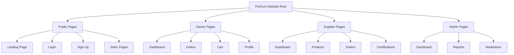
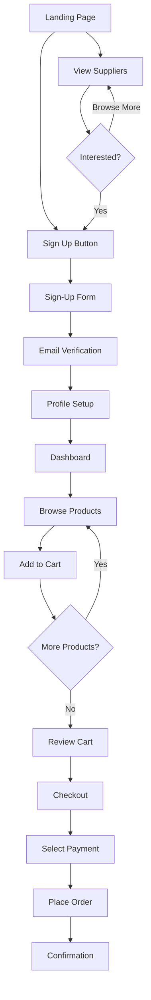
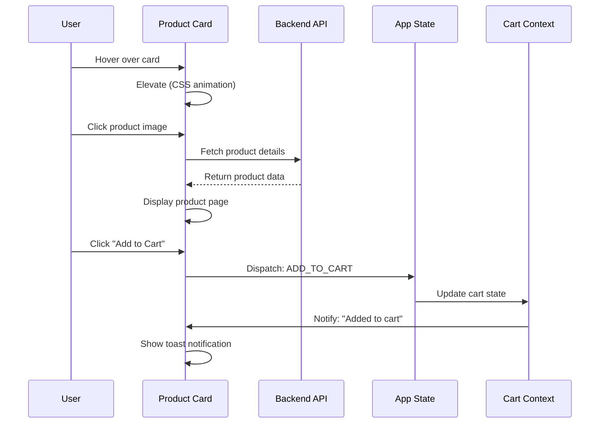
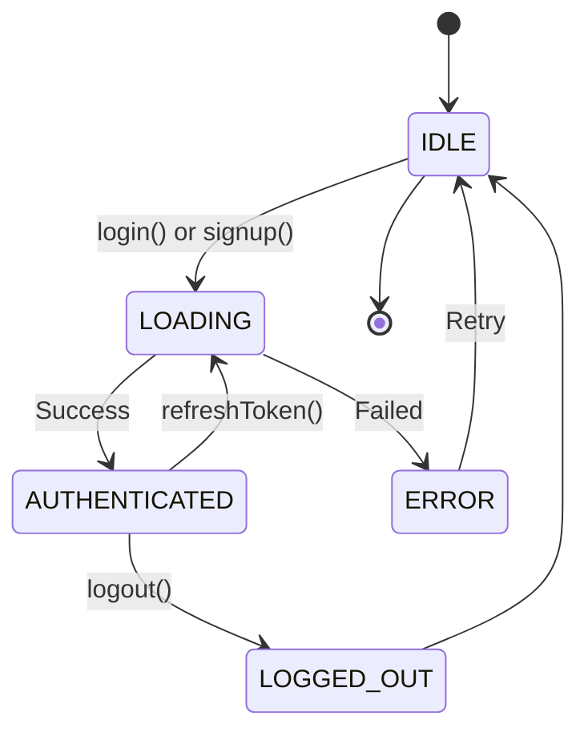

# ProCuro UI Diagram Recommendations — Visual Communication Guide

**Date**: 2026-05-19  
**Version**: 1.0  
**Purpose**: Define diagrams needed to communicate UI/UX structure in SDD  
**Tools**: Mermaid, Figma, Lucidchart, Draw.io

---

## 🔐 TEST CREDENTIALS

**Use these accounts for testing ProCuro:**

| Role | Email | Password |
|------|-------|----------|
| Admin | `procuro@admin.com` | `Md@121212` |
| Owner | `1999mud@gmail.com` | `Md@121212` |
| Supplier | `mariam.diallo@dialloherbs.de` | `Halal@2024` |

---

## 1. Diagram Types & Recommendations

### 1.1 Information Architecture (IA) Diagram

**Purpose**: Show site structure and page hierarchy

**Format**: Tree diagram or hierarchical structure

**Recommended Tool**: Mermaid (code-based), Draw.io (visual)

**Specification**:
```
ProCuro Website (Root)
│
├── Public Pages (No Auth Required)
│   ├── Landing Page (/)
│   │   ├── Hero Section
│   │   ├── Browse by Category
│   │   ├── Featured Products
│   │   ├── Featured Suppliers
│   │   ├── How It Works
│   │   └── Footer
│   │
│   ├── Authentication
│   │   ├── Login Page (/login)
│   │   └── Sign-Up Page (/register)
│   │
│   └── Static Pages
│       ├── About (/about)
│       ├── Careers (/careers)
│       ├── Press (/press)
│       ├── Help Center (/help)
│       ├── Privacy Policy (/privacy)
│       └── Terms of Service (/terms)
│
├── Owner Pages (Restaurant Owner Access Required)
│   ├── Dashboard (/owner/dashboard)
│   ├── Orders (/owner/orders)
│   ├── Cart (/owner/cart)
│   ├── Suppliers (/owner/suppliers)
│   └── Profile (/owner/profile)
│
├── Supplier Pages (Supplier Access Required)
│   ├── Dashboard (/supplier/dashboard)
│   ├── Products (/supplier/products)
│   ├── Orders (/supplier/orders)
│   ├── Certifications (/supplier/certs)
│   ├── Messages (/supplier/messages)
│   └── Settings (/supplier/settings)
│
└── Admin Pages (Admin Only)
    ├── Dashboard (/admin/dashboard)
    ├── Reports (/admin/reports)
    ├── Certifications (/admin/certifications)
    ├── Users (/admin/users)
    ├── Analytics (/admin/analytics)
    └── Moderation (/admin/moderation)
```

**Mermaid Code**:


**Use Case**: SDD Section 2 (Site Structure), user onboarding

**File Output**: `ia-diagram-full.svg`, `ia-diagram-mermaid.md`

---

### 1.2 User Journey Maps

**Purpose**: Show typical user paths through the application

**Format**: Flow diagram with decision points

**Three Key Journeys**:

#### Journey 1: New Restaurant Owner Registration & First Order

```
START
  ↓
Landing Page
  ├─ [Browse Suppliers]
  │   └─ View supplier profiles
  │       └─ View supplier products
  │           └─ [Sign Up]
  │
  └─ [Sign Up Button]
      ↓
Sign-Up Form
  ├─ Enter: Full Name, Email, Password
  ├─ Select: Role = "Restaurant Owner"
  └─ Submit
      ↓
Email Verification
  ├─ Confirm email address
  └─ Success
      ↓
Profile Setup
  ├─ Enter: Restaurant Name, Address, Phone
  ├─ Add: Delivery address(es)
  └─ Submit
      ↓
Onboarding Complete
  ↓
Dashboard (/owner/dashboard)
  ├─ View suppliers
  ├─ Browse products
  └─ [Start Order]
      ↓
Add Products to Cart
  ├─ Select supplier products
  ├─ Quantity + Special requests
  ├─ [Add to cart]
  └─ Repeat for multiple suppliers
      ↓
Review Cart
  ├─ View multi-supplier order
  ├─ Confirm prices & delivery
  └─ [Proceed to checkout]
      ↓
Checkout & Payment
  ├─ Shipping address verification
  ├─ Select payment method (COD or Bank Transfer)
  └─ [Place Order]
      ↓
Order Confirmation
  ├─ Confirmation email sent
  ├─ Order tracking available
  └─ END
```

**Mermaid Code**:


**File Output**: `user-journey-owner-registration.svg`

#### Journey 2: Existing Owner Placing Order

```
START
  ↓
Login (/login)
  ├─ Email + Password
  └─ [Log In]
      ↓
Owner Dashboard
  ├─ View recent suppliers
  ├─ View saved favorites
  └─ [Browse Suppliers] or [Search]
      ↓
Browse Products
  ├─ Filter by category
  ├─ Sort by price/rating
  └─ [View Supplier Details]
      ↓
Add to Cart
  ├─ Select quantity
  ├─ [Add to Cart]
  └─ Continue shopping?
      ↓
View Cart
  ├─ Review items by supplier
  ├─ Update quantities
  ├─ Apply coupons (if applicable)
  └─ [Proceed to Checkout]
      ↓
Checkout
  ├─ Confirm shipping address
  ├─ Confirm order items
  ├─ Select payment method
  └─ [Place Order]
      ↓
Order Confirmation
  ├─ Confirmation email
  ├─ Track order status
  └─ END
```

**File Output**: `user-journey-owner-ordering.svg`

#### Journey 3: New Supplier Onboarding

```
START
  ↓
Landing Page / Sign Up
  ├─ [Sign Up Button]
  └─ Select: Role = "Supplier"
      ↓
Sign-Up Form
  ├─ Enter: Business Name, Email, Password
  └─ Submit
      ↓
Email Verification
  ├─ Confirm email
  └─ Success
      ↓
Profile Setup
  ├─ Enter: Business name, description, address
  ├─ Select: Product categories (Meat, Poultry, etc.)
  ├─ Add: Contact phone, website
  └─ Submit
      ↓
Add Bank Details
  ├─ Enter: IBAN, Account Holder, Bank Name
  └─ Submit
      ↓
Upload Halal Certificate
  ├─ Upload: PDF/Image of cert
  ├─ Submitted for admin review
  └─ Status: "Pending"
      ↓
Waiting for Admin Approval
  ├─ Certificate reviewed
  ├─ If approved → is_verified = true
  └─ Status: "Verified"
      ↓
Dashboard (/supplier/dashboard)
  ├─ [Add Products]
  │   ├─ Name, description, price, unit
  │   ├─ Stock quantity
  │   ├─ Upload images
  │   └─ Publish
  │
  └─ Monitor orders
      ├─ Order comes in
      ├─ Confirm/accept order
      ├─ Prepare for shipment
      ├─ Mark as shipped
      └─ Receive payment
         ↓
         END
```

**File Output**: `user-journey-supplier-onboarding.svg`

**Use Case**: SDD Section 3 (User Workflows), product documentation

---

### 1.3 Component Interaction Diagram

**Purpose**: Show how UI components interact and communicate

**Format**: Interaction flow or sequence diagram

**Example: Product Card Interaction**

```
User
  │
  ├─ Hovers over Product Card
  │   └─ CSS: transform (elevation), shadow increase
  │
  ├─ Clicks Product Name/Image
  │   └─ Navigate to Product Detail Page
  │       ├─ Fetch: product details from API
  │       ├─ Display: full description, images, reviews
  │       └─ Show: "Add to Cart" button
  │
  ├─ Clicks "Add to Cart" Button
  │   └─ Frontend: Add to cart state/context
  │       ├─ Update: CartContext (React)
  │       ├─ Trigger: Toast notification "Added to cart"
  │       ├─ Update: Cart icon badge count
  │       └─ Option: [View Cart] or [Continue Shopping]
  │
  └─ Clicks Cart Icon (if created)
      └─ Navigate to /owner/cart
          ├─ Display: all items organized by supplier
          ├─ Update: quantities
          ├─ Show: subtotal, total, delivery fees
          └─ [Proceed to Checkout]
```

**Mermaid Sequence Diagram**:


**File Output**: `component-interaction-product-card.svg`

---

### 1.4 Data Flow Diagram

**Purpose**: Show how data moves between components and backend

**Format**: Flow diagram with data transformation

**Example: Order Creation Flow**

```
Frontend (React)
  ├─ User adds products to cart
  │   └─ CartContext: stores { supplierId, productId, quantity }
  │
  ├─ User proceeds to checkout
  │   └─ CartContext → Create order payload
  │       {
  │         restaurant_owner_id: uuid,
  │         items: [
  │           { supplier_id, product_id, quantity }
  │         ]
  │       }
  │
  └─ POST /api/orders (or Supabase RPC)
      │
      └─ Backend (Supabase PostgreSQL)
          ├─ Create: orders record
          ├─ For each supplier:
          │   ├─ Create: order_splits record
          │   └─ Create: order_items records
          ├─ Update: product.stock_quantity (decrement)
          └─ Trigger: notifications to suppliers
      │
      └─ Response: { order_id, splits: [...], total_amount }
          │
          └─ Frontend
              ├─ Clear: CartContext
              ├─ Store: order confirmation in local state
              ├─ Show: confirmation screen
              └─ Update: owner's order history
```

**File Output**: `data-flow-order-creation.svg`

---

### 1.5 State Management Diagram

**Purpose**: Show app state and how it changes

**Format**: State machine or Context tree

**Example: Authentication State**

```
┌─ Global Auth State (Context)
│
├─ user: null
├─ isLoading: false
├─ error: null
├─ role: null
│
└─ States:
   ├─ IDLE
   │   └─ No auth request in progress
   │   └─ user = null
   │
   ├─ LOADING
   │   └─ Auth request in progress (login/signup)
   │   └─ isLoading = true
   │
   ├─ AUTHENTICATED
   │   ├─ user = { id, email, role, ... }
   │   ├─ isLoading = false
   │   └─ Can access protected routes
   │
   ├─ ERROR
   │   ├─ error = "Invalid credentials"
   │   ├─ isLoading = false
   │   └─ User can retry
   │
   └─ LOGGED_OUT
       ├─ user = null
       ├─ isLoading = false
       └─ Redirect to login
```

**Mermaid State Diagram**:


**File Output**: `state-machine-authentication.svg`

---

### 1.6 Responsive Breakpoint Diagram

**Purpose**: Show how layout changes at different screen sizes

**Format**: Visual comparison or annotation diagram

**Specification**:

```
┌──────────────────────────────────────────────────────────────────┐
│ DESKTOP (1024px+)                                                │
├──────────────────────────────────────────────────────────────────┤
│ [Logo]                    [Log In] [Sign Up]                      │
├──────────────────────────────────────────────────────────────────┤
│ Hero Section (Full Width)                                         │
├──────────────────────────────────────────────────────────────────┤
│ [Cat1] [Cat2] [Cat3] [Cat4] [Cat5] [Cat6]...                   │
├──────────────────────────────────────────────────────────────────┤
│ [Prod1] [Prod2] [Prod3] [Prod4]                                  │
│ [Prod5] [Prod6] [Prod7] [Prod8]                                  │
├──────────────────────────────────────────────────────────────────┤
│ [Supp1] [Supp2] [Supp3]                                          │
│ [Supp4] [Supp5] [Supp6]                                          │
└──────────────────────────────────────────────────────────────────┘
    1024px

┌────────────────────────────────┐
│ TABLET (768px-1023px)          │
├────────────────────────────────┤
│ [Logo]    [Log In] [Sign Up]   │
├────────────────────────────────┤
│ Hero Section (Full Width)      │
├────────────────────────────────┤
│ [Cat1] [Cat2] [Cat3] [scroll]  │
├────────────────────────────────┤
│ [Prod1] [Prod2]                │
│ [Prod3] [Prod4]                │
│ [Prod5] [Prod6]                │
├────────────────────────────────┤
│ [Supp1] [Supp2]                │
│ [Supp3] [Supp4]                │
└────────────────────────────────┘
    768px

┌──────────────────┐
│ MOBILE (< 768px) │
├──────────────────┤
│ [☰] [ProCuro] [👤]
├──────────────────┤
│ Hero Section     │
├──────────────────┤
│ [Cat1]           │
│ [Cat2]           │
│ [Cat3]           │
│ [Scroll]         │
├──────────────────┤
│ [Prod1]          │
│ [Prod2]          │
│ [Prod3]          │
│ [Prod4]          │
├──────────────────┤
│ [Supp1]          │
│ [Supp2]          │
│ [Supp3]          │
└──────────────────┘
    375px
```

**File Output**: `responsive-breakpoints-comparison.svg`

**Use Case**: SDD Section 4.8 (Responsive Design)

---

### 1.7 Feature Priority Matrix (MOSCOW)

**Purpose**: Show which features are in scope for launch vs. future

**Format**: 2x2 Matrix

```
                  CRITICAL FOR SUCCESS
                         ↑
                         │
MUST HAVE               │ SHOULD HAVE
├─ User registration    │ ├─ Product reviews
├─ Product listing      │ ├─ Supplier messaging
├─ Shopping cart        │ ├─ Wishlist
├─ Order placement      │ ├─ Advanced search filters
├─ Payment (COD/Bank)   │ ├─ Supplier loyalty program
├─ Supplier signup      │ └─ Analytics dashboard
├─ Halal certification  │
├─ Admin panel          │ COULD HAVE
└─ Order tracking       │ ├─ Mobile app
                        │ ├─ AR product preview
    ────────────────────┼────────────────────────
                        │ WON'T HAVE (v1)
                        │ ├─ Cryptocurrency payment
                        │ ├─ AI recipe suggestions
                        │ ├─ Drone delivery
                        │ └─ Blockchain cert storage

                    NICE TO HAVE
```

**File Output**: `feature-priority-moscow.svg`

---

### 1.8 Error Handling Flow

**Purpose**: Show how errors are communicated to users

**Format**: Decision tree or error matrix

```
ERROR OCCURS
  │
  ├─ Validation Error (Form)
  │   └─ Display: inline error below field
  │       └─ Message: "Invalid email format"
  │       └─ Color: Red
  │
  ├─ Network Error (API)
  │   └─ Display: Toast notification (top-right)
  │       └─ Message: "Network error. Please try again."
  │       └─ Action: [Retry] button
  │
  ├─ Authentication Error
  │   └─ Display: Modal dialog
  │       └─ Message: "Your session expired. Log in again."
  │       └─ Action: [Log In] button → /login
  │
  ├─ Permission Error (403)
  │   └─ Display: Page overlay
  │       └─ Message: "You don't have permission to access this."
  │       └─ Action: [Go Back] or [Home]
  │
  ├─ Not Found (404)
  │   └─ Display: Full page error screen
  │       └─ Message: "Page not found"
  │       └─ Suggestions: [Home], [Browse], [Contact Support]
  │
  └─ Server Error (500)
      └─ Display: Full page error screen
          └─ Message: "Something went wrong. We're working on it."
          └─ Action: [Report Issue]
```

**File Output**: `error-handling-flow.svg`

---

## 2. Mermaid Diagram Library

### Recommended Mermaid Diagrams for SDD

| Diagram Type | Mermaid Syntax | Use Case | File |
|---|---|---|---|
| Flowchart | `graph TD` | User journeys, processes | `*.mermaid.md` |
| Sequence | `sequenceDiagram` | Component interactions, API calls | `*.sequence.mermaid` |
| State | `stateDiagram-v2` | Auth states, UI states | `*.state.mermaid` |
| ER Diagram | `erDiagram` | Database relationships | `*.er.mermaid` |
| Class | `classDiagram` | Component structure | `*.class.mermaid` |
| Pie Chart | `pie` | Feature breakdown | `*.pie.mermaid` |
| Git Graph | `gitGraph` | Release process | `*.git.mermaid` |

### Storage Strategy
- Store Mermaid code in `.mermaid.md` files
- Include in SDD markdown with `\`\`\`mermaid` blocks
- Generate PNG/SVG via mermaid.live or CLI tool

---

## 3. Figma Design System

### Recommended Figma Organization

```
ProCuro Design System
├── Pages
│   ├── 📐 Styles & Variables
│   │   ├─ Colors (primary, secondary, gray scale)
│   │   ├─ Typography (font sizes, weights, line heights)
│   │   └─ Spacing (8px grid, padding, margin)
│   │
│   ├── 🧩 Components
│   │   ├─ Buttons (primary, secondary, ghost, states)
│   │   ├─ Forms (input, textarea, select, validation states)
│   │   ├─ Cards (product, supplier, feature card)
│   │   ├─ Navigation (navbar, footer, breadcrumbs)
│   │   ├─ Badges (category, certification, rating)
│   │   └─ Modals (confirmation, error, info)
│   │
│   ├── 📱 Layouts
│   │   ├─ Desktop (1920px)
│   │   ├─ Tablet (768px)
│   │   └─ Mobile (375px)
│   │
│   ├── 🎨 Screens
│   │   ├─ Landing Page
│   │   ├─ Login/Sign-Up
│   │   ├─ Owner Dashboard
│   │   ├─ Product Listing
│   │   └─ Checkout Flow
│   │
│   ├── 🔄 Interactions
│   │   ├─ Hover states
│   │   ├─ Focus states
│   │   ├─ Active states
│   │   └─ Loading states
│   │
│   └── 📊 Diagrams
│       ├─ IA diagram
│       ├─ User journeys
│       ├─ Responsive comparison
│       └─ Feature matrix
```

**File Output**: Figma design file (shared link)

---

## 4. Diagram Delivery Checklist

### High Priority (P0)
- [ ] Information Architecture Diagram
- [ ] User Journey: Owner Registration
- [ ] User Journey: Owner Placing Order
- [ ] Component Interaction: Product Card
- [ ] Responsive Breakpoints Comparison

### Medium Priority (P1)
- [ ] User Journey: Supplier Onboarding
- [ ] Data Flow: Order Creation
- [ ] State Management: Authentication
- [ ] Error Handling Flow
- [ ] Feature Priority Matrix

### Lower Priority (P2)
- [ ] Component Interaction: Cart
- [ ] Component Interaction: Order Tracking
- [ ] Sequence Diagram: API Requests
- [ ] Class Diagram: React Components
- [ ] Figma Design System

---

## 5. SDD Section Mapping

| SDD Section | Diagrams |
|---|---|
| 2. System Overview | IA Diagram, Feature Matrix |
| 3. User Workflows | User Journeys (all 3), State Machine |
| 4.1 Frontend Architecture | Component Interaction, State Management |
| 4.2 Page Layouts | Responsive Breakpoints, Wireframes |
| 4.3 Component Library | Figma components, Interaction states |
| 4.4 Data Flow | Data Flow Diagram, Sequence Diagrams |
| 4.5 Error Handling | Error Handling Flow |
| 4.6 Security | Auth State Machine |
| 4.7 Accessibility | Accessibility guidelines (text, not diagram) |
| 4.8 Performance | Performance metrics (text, not diagram) |

---

## 6. Tools & Resources

### Recommended Tools
- **Mermaid.live**: Free online Mermaid editor (mermaid.live)
- **Figma**: Design system & prototyping (figma.com)
- **Draw.io**: Free diagramming (diagrams.net)
- **Lucidchart**: Professional diagramming (lucidchart.com)
- **GitHub**: Store Mermaid code in markdown

### Export Formats
- PNG: For embedding in documents
- SVG: For scalability and editing
- PDF: For printing
- Interactive: HTML for presentations

---

**Generated**: 2026-05-19 02:16:00 GMT  
**Document Version**: 1.0  
**Status**: Specifications complete, diagrams pending creation
